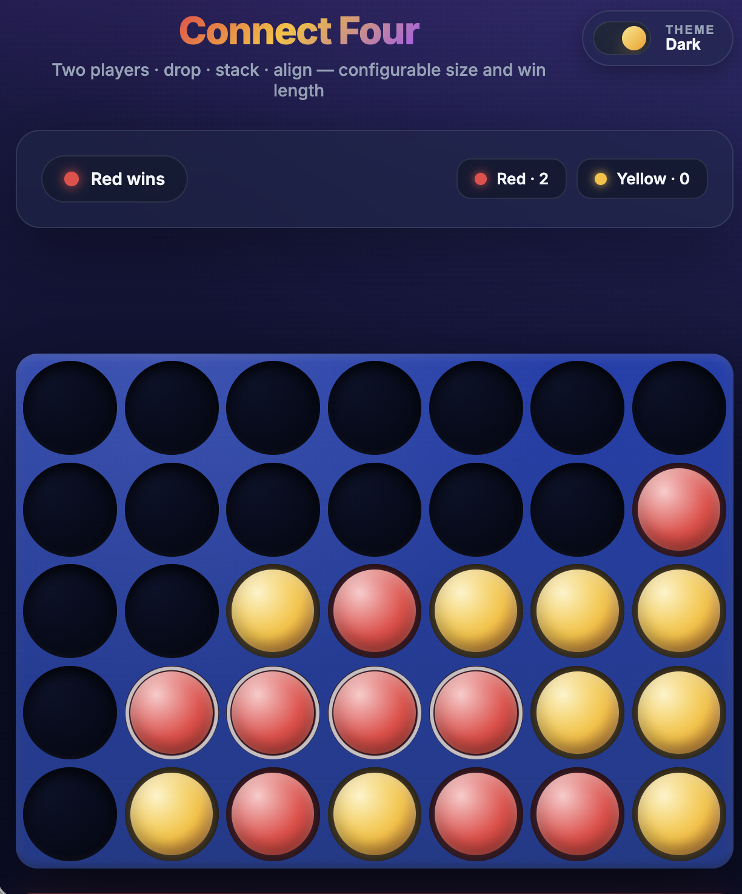

# Connect Four — Compose HTML

A web-based Connect Four built with **Compose HTML** (Kotlin/JS).
Two-player local play, with a configurable board size (4×4 → 15×15) and
configurable win length (3 → 10). Designed to look great on desktop and
mobile, with falling-piece animations, a winning-row highlight, and a
game state that persists across page refreshes.

 

## Highlights

- **Configurable board** — rows, columns, and win length, all live-editable.
- **Gravity-based gameplay** — pieces stack from the bottom, with full-column detection.
- **Win / draw detection** — checks horizontal, vertical, and both diagonals from the last move (O(rows + columns) per move).
- **Responsive UI** — CSS Grid + `aspect-ratio` keeps the board square and playable from a 320 px phone to a 4K display.
- **Drop animation** — each placed piece falls from above its column with a subtle bounce.
- **Winner highlight** — winning cells get a pulsing ring.
- **Hover preview** — hovering a column shows a translucent ghost of the next piece.
- **Persistence** — the entire game state (board, scores, current player, win state) survives a refresh via `localStorage`, serialized with `kotlinx.serialization`.
- **Score keeping** — running tally per player across rounds; alternates the starter each new round.
- **Tests** — Kotlin/JS tests cover board mechanics, win detection, and the game state machine.

## Project layout

```
src/jsMain/
  kotlin/
    Main.kt                       # Compose entry point
    game/                         # Pure game logic (no DOM/JS deps)
      Player.kt
      Board.kt                    # immutable + gravity drop
      GameConfig.kt
      WinDetector.kt              # 4-direction line scan
      GameState.kt                # full state machine (+ Score)
    persistence/
      GameStorage.kt              # localStorage + kotlinx.serialization
    ui/
      App.kt                      # top-level composable
      BoardView.kt                # board + indicator + animations
      ControlsView.kt             # configurable inputs + actions
      StatusBar.kt                # turn indicator + scoreboard
  resources/
    index.html                    # design-system CSS lives here
src/jsTest/kotlin/
  BoardTest.kt
  WinDetectorTest.kt
  GameStateTest.kt
```

The game logic is decoupled from the rendering layer: `game/`
has no dependency on `ui/`, `persistence/`, or anything browser-specific.
That keeps the core unit-testable and easy to reason about.

## Running

Requires JDK 21. The repo already includes the Gradle wrapper and an
`.sdkmanrc`. Open the project in IntelliJ IDEA / Fleet for the smoothest
experience; both auto-import the Compose plugin.

```bash
# dev server with live reload at http://localhost:8080
./gradlew jsBrowserDevelopmentRun --continuous

# production bundle
./gradlew jsBrowserDistribution

# run the tests (Karma + headless Chrome)
./gradlew jsTest
```

If you don't have Chrome installed for Karma, swap the `useChromeHeadless()`
call in `build.gradle.kts` for `useFirefoxHeadless()`. If you want a real JVM
test target, promote `game/` to `commonMain` and add a JVM target explicitly.

## Design notes

- **State is one immutable value.** Every move returns a new `GameState`;
  illegal moves return the same instance. This makes persistence trivial
  (serialize the whole thing) and makes Compose recomposition predictable.
- **Win detection runs on the last move only.** Walk in 4 directions from
  the dropped piece, count contiguous same-color cells; cheap and simple.
- **Animation is CSS-driven.** A `--drop-height` custom property is set on
  the just-placed piece so the keyframe knows how far above its slot to start.
  Compose simply mounts a new `<div class="piece animated">`; CSS does the rest.
- **Hover indicator** floats above the board in a separate row that shares
  the same grid template, so it stays pixel-aligned at any size.
- **Persistence** uses a single versioned key (`connect-four/game-state/v1`).
  If the schema ever changes, bumping the suffix invalidates old saves
  cleanly without crashing the app.

# Usage of AI
I used Claude for debugging and generating some test cases. The main
components were implemented by me.
